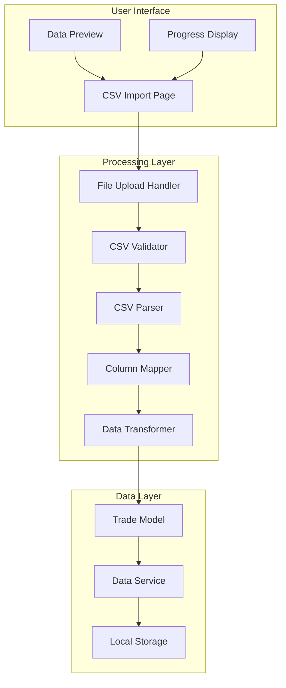
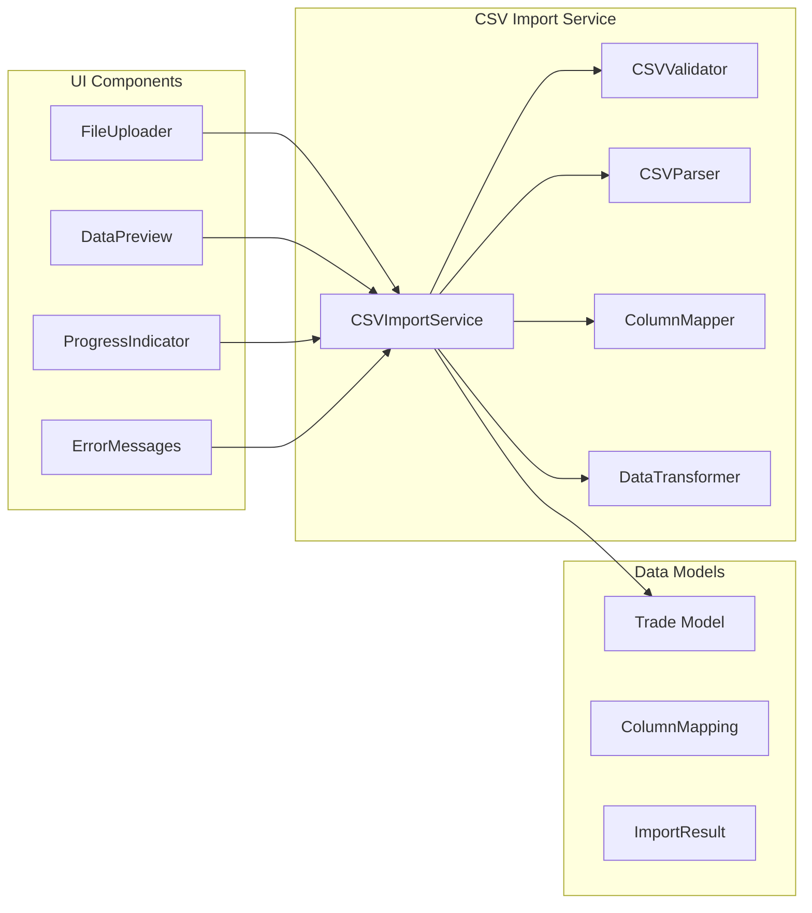

# CSV Trade Ingestion System Design

## Overview

The CSV Trade Ingestion System is a secure, offline data import solution that completely replaces exchange API integrations. The system processes CSV files locally without any external network connections, providing a safe method for importing trade data from various sources.

## Architecture

### High-Level Architecture



### Component Architecture



## Components and Interfaces

### 1. CSV Import Service (`csv_import_service.py`)

Main orchestrator for the CSV import process.

```python
class CSVImportService:
    def __init__(self, data_service: DataService):
        self.data_service = data_service
        self.validator = CSVValidator()
        self.parser = CSVParser()
        self.mapper = ColumnMapper()
        self.transformer = DataTransformer()
    
    def import_csv_file(self, file_path: str, mapping_config: Optional[ColumnMapping] = None) -> ImportResult:
        """Import trades from CSV file with full validation and error handling."""
        pass
    
    def validate_csv_file(self, file_path: str) -> ValidationResult:
        """Validate CSV file structure and data quality."""
        pass
    
    def preview_csv_data(self, file_path: str, mapping: ColumnMapping, rows: int = 10) -> List[Dict]:
        """Generate preview of mapped data before import."""
        pass
    
    def get_suggested_mapping(self, csv_headers: List[str]) -> ColumnMapping:
        """Suggest column mapping based on header analysis."""
        pass
```

### 2. CSV Validator (`csv_validator.py`)

Validates CSV file structure and data integrity.

```python
class CSVValidator:
    def validate_file_format(self, file_path: str) -> ValidationResult:
        """Validate basic file format and structure."""
        pass
    
    def validate_data_types(self, df: pd.DataFrame, mapping: ColumnMapping) -> ValidationResult:
        """Validate data types for mapped columns."""
        pass
    
    def validate_required_fields(self, df: pd.DataFrame, mapping: ColumnMapping) -> ValidationResult:
        """Ensure all required fields are present and valid."""
        pass
    
    def detect_duplicates(self, df: pd.DataFrame) -> List[int]:
        """Detect potential duplicate trades."""
        pass
```

### 3. CSV Parser (`csv_parser.py`)

Handles CSV file parsing with multiple format support.

```python
class CSVParser:
    def parse_csv_file(self, file_path: str) -> pd.DataFrame:
        """Parse CSV file with automatic delimiter and encoding detection."""
        pass
    
    def detect_delimiter(self, file_path: str) -> str:
        """Detect CSV delimiter (comma, semicolon, etc.)."""
        pass
    
    def detect_encoding(self, file_path: str) -> str:
        """Detect file encoding (UTF-8, etc.)."""
        pass
    
    def parse_dates(self, df: pd.DataFrame, date_columns: List[str]) -> pd.DataFrame:
        """Parse date columns with multiple format support."""
        pass
```

### 4. Column Mapper (`column_mapper.py`)

Manages mapping between CSV columns and Trade model fields.

```python
class ColumnMapper:
    def create_mapping(self, csv_headers: List[str], manual_mapping: Dict[str, str] = None) -> ColumnMapping:
        """Create column mapping from CSV headers to Trade fields."""
        pass
    
    def suggest_mapping(self, csv_headers: List[str]) -> ColumnMapping:
        """Suggest automatic mapping based on header analysis."""
        pass
    
    def validate_mapping(self, mapping: ColumnMapping) -> ValidationResult:
        """Validate that mapping covers all required fields."""
        pass
    
    def save_mapping_template(self, mapping: ColumnMapping, name: str) -> bool:
        """Save mapping configuration for reuse."""
        pass
```

### 5. Data Transformer (`data_transformer.py`)

Transforms CSV data to Trade model format.

```python
class DataTransformer:
    def transform_row(self, row: pd.Series, mapping: ColumnMapping) -> Trade:
        """Transform single CSV row to Trade object."""
        pass
    
    def calculate_missing_pnl(self, trade_data: Dict) -> Optional[Decimal]:
        """Calculate PnL when not provided in CSV."""
        pass
    
    def normalize_trade_side(self, side_value: str) -> TradeSide:
        """Convert various side formats to TradeSide enum."""
        pass
    
    def parse_timestamp(self, timestamp_str: str) -> datetime:
        """Parse timestamp with multiple format support."""
        pass
```

## Data Models

### Column Mapping Model

```python
@dataclass
class ColumnMapping:
    """Defines mapping between CSV columns and Trade model fields."""
    symbol: str  # CSV column name for symbol
    side: str    # CSV column name for trade side
    quantity: str # CSV column name for quantity
    entry_price: str # CSV column name for entry price
    exit_price: Optional[str] = None # CSV column name for exit price
    entry_time: str # CSV column name for entry timestamp
    exit_time: Optional[str] = None # CSV column name for exit timestamp
    pnl: Optional[str] = None # CSV column name for PnL
    fees: Optional[str] = None # CSV column name for fees
    
    # Mapping metadata
    name: str = "Default"
    description: Optional[str] = None
    created_at: datetime = field(default_factory=datetime.now)
```

### Import Result Model

```python
@dataclass
class ImportResult:
    """Result of CSV import operation."""
    success: bool
    total_rows: int
    imported_trades: int
    skipped_rows: int
    duplicate_trades: int
    errors: List[str]
    warnings: List[str]
    processing_time: float
    
    def get_summary(self) -> str:
        """Get human-readable import summary."""
        pass
```

### Validation Result Model

```python
@dataclass
class ValidationResult:
    """Result of CSV validation operation."""
    is_valid: bool
    errors: List[ValidationError]
    warnings: List[ValidationWarning]
    
    def has_blocking_errors(self) -> bool:
        """Check if validation has errors that prevent import."""
        pass
```

## CSV Format Support

### Bitunix Format (Primary)

Based on the provided sample file:

```csv
Date,symbol,side,quantity,asset,Entry Price,Exit Price,Gross PnL,Net PnL,Fees,margin,Opening Date,Closed Value
```

**Column Mapping:**
- `Date` → `exit_time`
- `symbol` → `symbol`
- `side` → `side` (Long/Short → TradeSide enum)
- `quantity` → `quantity`
- `Entry Price` → `entry_price`
- `Exit Price` → `exit_price`
- `Net PnL` → `pnl`
- `Fees` → `fees` (stored in custom_fields)
- `Opening Date` → `entry_time`

### Generic Format Support

The system will support flexible column mapping for other formats:

```python
COMMON_COLUMN_PATTERNS = {
    'symbol': ['symbol', 'pair', 'instrument', 'market'],
    'side': ['side', 'direction', 'type', 'position'],
    'quantity': ['quantity', 'amount', 'size', 'volume'],
    'entry_price': ['entry_price', 'open_price', 'entry', 'open'],
    'exit_price': ['exit_price', 'close_price', 'exit', 'close'],
    'entry_time': ['entry_time', 'open_time', 'opening_date', 'start_time'],
    'exit_time': ['exit_time', 'close_time', 'date', 'end_time'],
    'pnl': ['pnl', 'profit_loss', 'net_pnl', 'realized_pnl']
}
```

## User Interface Design

### CSV Import Page Layout

```
┌─────────────────────────────────────────────────────────────┐
│ CSV Trade Import                                            │
├─────────────────────────────────────────────────────────────┤
│                                                             │
│ ┌─────────────────────────────────────────────────────────┐ │
│ │  📁 Drag & Drop CSV File Here                           │ │
│ │     or click to browse                                  │ │
│ │                                                         │ │
│ │  Supported formats: .csv (max 50MB)                    │ │
│ └─────────────────────────────────────────────────────────┘ │
│                                                             │
│ ┌─────────────────────────────────────────────────────────┐ │
│ │ Column Mapping                                          │ │
│ │ ┌─────────────┬─────────────────────────────────────┐   │ │
│ │ │ CSV Column  │ Maps To                             │   │ │
│ │ ├─────────────┼─────────────────────────────────────┤   │ │
│ │ │ Date        │ Exit Time ▼                         │   │ │
│ │ │ symbol      │ Symbol ▼                            │   │ │
│ │ │ side        │ Trade Side ▼                        │   │ │
│ │ └─────────────┴─────────────────────────────────────┘   │ │
│ └─────────────────────────────────────────────────────────┘ │
│                                                             │
│ ┌─────────────────────────────────────────────────────────┐ │
│ │ Data Preview (First 10 rows)                           │ │
│ │ ┌─────────┬──────┬──────┬──────────┬──────────┬──────┐ │ │
│ │ │ Symbol  │ Side │ Qty  │ Entry    │ Exit     │ PnL  │ │ │
│ │ ├─────────┼──────┼──────┼──────────┼──────────┼──────┤ │ │
│ │ │ BTCUSDT │ Long │ 0.1  │ 50000.00 │ 51000.00 │ 100  │ │ │
│ │ └─────────┴──────┴──────┴──────────┴──────────┴──────┘ │ │
│ └─────────────────────────────────────────────────────────┘ │
│                                                             │
│ [Cancel]                                    [Import Trades] │
└─────────────────────────────────────────────────────────────┘
```

### Progress Display

```
┌─────────────────────────────────────────────────────────────┐
│ Importing Trades...                                         │
├─────────────────────────────────────────────────────────────┤
│                                                             │
│ ████████████████████████████████████████████████████ 85%   │
│                                                             │
│ Processing row 850 of 1000                                 │
│ Imported: 847 trades                                       │
│ Skipped: 3 duplicates                                      │
│                                                             │
│ [Cancel Import]                                             │
└─────────────────────────────────────────────────────────────┘
```

## Error Handling

### Validation Errors

```python
class ValidationError:
    row: int
    column: str
    error_type: str
    message: str
    suggested_fix: Optional[str]
```

### Error Categories

1. **File Format Errors**
   - Invalid CSV structure
   - Encoding issues
   - File size exceeded

2. **Data Type Errors**
   - Invalid numeric values
   - Unparseable dates
   - Missing required fields

3. **Business Logic Errors**
   - Invalid trade sides
   - Negative quantities/prices
   - Exit time before entry time

4. **Duplicate Detection**
   - Same timestamp + symbol
   - Configurable duplicate criteria

## Testing Strategy

### Unit Tests

- CSV parsing with various formats
- Data validation logic
- Column mapping algorithms
- Data transformation accuracy

### Integration Tests

- End-to-end import process
- Error handling scenarios
- Large file processing
- UI component integration

### Test Data

- Sample CSV files from different exchanges
- Edge cases (malformed data, missing fields)
- Performance test files (large datasets)

## Performance Considerations

### Memory Management

- Process large files in chunks (1000 rows at a time)
- Stream processing for files > 10MB
- Garbage collection between batches

### Processing Optimization

- Pandas vectorized operations
- Batch database inserts
- Progress callbacks for UI updates

### File Size Limits

- Maximum file size: 50MB
- Maximum rows: 100,000 trades
- Timeout: 5 minutes for import

## Security Considerations

### File Handling

- Validate file extensions
- Scan for malicious content
- Temporary file cleanup
- No external network access

### Data Validation

- Input sanitization
- SQL injection prevention
- XSS protection in preview display

### Error Information

- Sanitize error messages
- No sensitive data in logs
- Secure temporary file storage