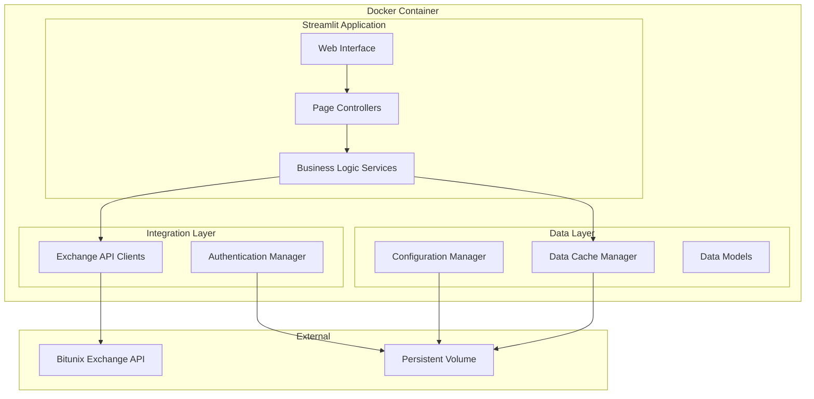

# Design Document

## Overview

The Crypto Trading Journal is a containerized Python application built with Streamlit that provides comprehensive trading analysis and data management capabilities. The system integrates with crypto exchanges via REST APIs, maintains persistent local data storage, and offers an extensible architecture for future enhancements.

### Key Design Principles

- **Containerization**: Docker-based deployment for consistency and portability
- **Data Persistence**: Volume-mounted storage for configuration and trade data
- **Extensibility**: Plugin-based architecture for adding new exchanges and custom fields
- **Security**: Encrypted storage of API credentials and secure data handling
- **Performance**: Efficient data caching and incremental synchronization

## Architecture

### High-Level Architecture



### Application Structure

```
crypto-trading-journal/
├── app/
│   ├── main.py                 # Streamlit entry point
│   ├── pages/                  # Streamlit pages
│   │   ├── trade_history.py
│   │   ├── trend_analysis.py
│   │   ├── confluence_analysis.py
│   │   └── config.py
│   ├── services/               # Business logic
│   │   ├── exchange_service.py
│   │   ├── data_service.py
│   │   ├── analysis_service.py
│   │   └── config_service.py
│   ├── models/                 # Data models
│   │   ├── trade.py
│   │   ├── position.py
│   │   ├── exchange_config.py
│   │   └── custom_fields.py
│   ├── integrations/           # Exchange integrations
│   │   ├── base_exchange.py
│   │   └── bitunix_client.py
│   └── utils/                  # Utilities
│       ├── encryption.py
│       ├── data_migration.py
│       └── validators.py
├── data/                       # Persistent data (volume mount)
│   ├── trades.json
│   ├── config.json
│   └── credentials.enc
├── Dockerfile
├── requirements.txt
└── docker-compose.yml
```

## Components and Interfaces

### 1. Streamlit Application Layer

#### Main Application (`main.py`)
- **Purpose**: Entry point and navigation controller
- **Responsibilities**: 
  - Initialize application state
  - Handle page routing
  - Manage global session state
  - Load configuration on startup

#### Page Controllers
- **Trade History Page**: Display and filter trade records
- **Trend Analysis Page**: Render time-series PnL charts
- **Confluence Analysis Page**: Show performance metrics by confluence
- **Config Page**: Manage exchange settings and custom fields

### 2. Service Layer

#### Exchange Service (`exchange_service.py`)
```python
class ExchangeService:
    def sync_positions(self, exchange_name: str) -> List[Position]
    def test_api_connection(self, exchange_name: str, api_key: str) -> bool
    def get_position_history(self, exchange_name: str, since: datetime) -> List[Position]
    def reconcile_data(self, local_data: List[Position], remote_data: List[Position]) -> List[Position]
```

#### Data Service (`data_service.py`)
```python
class DataService:
    def load_trades(self) -> List[Trade]
    def save_trades(self, trades: List[Trade]) -> None
    def update_trade(self, trade_id: str, updates: Dict) -> None
    def get_trades_by_date_range(self, start: datetime, end: datetime) -> List[Trade]
    def backup_data(self) -> None
```

#### Analysis Service (`analysis_service.py`)
```python
class AnalysisService:
    def calculate_pnl_trend(self, trades: List[Trade], timeframe: str) -> DataFrame
    def analyze_confluences(self, trades: List[Trade]) -> Dict[str, Dict]
    def calculate_win_rate(self, trades: List[Trade], confluence: str = None) -> float
    def generate_performance_metrics(self, trades: List[Trade]) -> Dict
```

### 3. Integration Layer

#### Base Exchange Interface (`base_exchange.py`)
```python
class BaseExchange(ABC):
    @abstractmethod
    def authenticate(self, api_key: str, api_secret: str) -> bool
    
    @abstractmethod
    def get_position_history(self, since: datetime = None) -> List[Dict]
    
    @abstractmethod
    def test_connection(self) -> bool
    
    @abstractmethod
    def parse_position_data(self, raw_data: Dict) -> Position
```

#### Bitunix Client (`bitunix_client.py`)
- **API Endpoints**: 
  - `/api/v1/position/history` for position data
  - Authentication via API key headers
- **Rate Limiting**: Implement request throttling per API documentation
- **Error Handling**: Robust error handling for network and API errors

## Data Models

### Trade Model
```python
@dataclass
class Trade:
    id: str
    exchange: str
    symbol: str
    side: str  # 'long' or 'short'
    entry_price: Decimal
    exit_price: Optional[Decimal]
    quantity: Decimal
    entry_time: datetime
    exit_time: Optional[datetime]
    pnl: Optional[Decimal]
    status: str  # 'open', 'partially_closed', 'closed'
    confluences: List[str]
    win_loss: Optional[str]  # 'win', 'loss', None
    custom_fields: Dict[str, Any]
    created_at: datetime
    updated_at: datetime
```

### Position Model
```python
@dataclass
class Position:
    position_id: str
    symbol: str
    side: str
    size: Decimal
    entry_price: Decimal
    mark_price: Decimal
    unrealized_pnl: Decimal
    realized_pnl: Decimal
    status: str
    open_time: datetime
    close_time: Optional[datetime]
    raw_data: Dict  # Store original exchange data
```

### Configuration Models
```python
@dataclass
class ExchangeConfig:
    name: str
    api_key_encrypted: str
    is_active: bool
    last_sync: Optional[datetime]
    connection_status: str

@dataclass
class CustomFieldConfig:
    field_name: str
    field_type: str  # 'multiselect', 'select', 'text', 'number'
    options: List[str]
    is_required: bool
```

## Error Handling

### API Error Handling
- **Network Errors**: Retry logic with exponential backoff
- **Authentication Errors**: Clear error messages and credential validation
- **Rate Limiting**: Respect API limits and queue requests appropriately
- **Data Parsing Errors**: Graceful handling of unexpected API response formats

### Data Integrity
- **Validation**: Input validation for all user data and API responses
- **Backup**: Automatic data backups before major operations
- **Recovery**: Data recovery mechanisms for corrupted files
- **Migration**: Automatic schema migration for data model updates

### User Experience
- **Loading States**: Progress indicators for long-running operations
- **Error Messages**: User-friendly error messages with actionable guidance
- **Fallback UI**: Graceful degradation when services are unavailable

## Testing Strategy

### Unit Testing
- **Models**: Test data validation and serialization
- **Services**: Mock external dependencies and test business logic
- **Utilities**: Test encryption, validation, and data transformation functions
- **Coverage Target**: 90% code coverage for core business logic

### Integration Testing
- **API Integration**: Test exchange API clients with mock servers
- **Data Persistence**: Test data storage and retrieval operations
- **End-to-End Workflows**: Test complete user workflows from UI to data storage

### Performance Testing
- **Data Loading**: Test performance with large datasets (10k+ trades)
- **API Response Times**: Measure and optimize API call performance
- **Memory Usage**: Monitor memory consumption during data operations

### Security Testing
- **Credential Storage**: Verify encryption and secure storage of API keys
- **Input Validation**: Test against injection attacks and malformed data
- **Data Access**: Ensure proper access controls and data isolation

## Deployment Configuration

### Docker Configuration
```dockerfile
FROM python:3.11-slim

WORKDIR /app
COPY requirements.txt .
RUN pip install -r requirements.txt

COPY app/ ./app/
EXPOSE 8501

VOLUME ["/app/data"]

CMD ["streamlit", "run", "app/main.py", "--server.port=8501", "--server.address=0.0.0.0"]
```

### Docker Compose
```yaml
version: '3.8'
services:
  trading-journal:
    build: .
    ports:
      - "8501:8501"
    volumes:
      - ./data:/app/data
    environment:
      - PYTHONPATH=/app
    restart: unless-stopped
```

### Environment Variables
- `DATA_PATH`: Path to persistent data directory
- `LOG_LEVEL`: Application logging level
- `ENCRYPTION_KEY`: Key for credential encryption (generated on first run)

## Security Considerations

### API Key Management
- **Encryption**: AES-256 encryption for stored credentials
- **Key Derivation**: PBKDF2 for encryption key generation
- **Memory Protection**: Clear sensitive data from memory after use

### Data Protection
- **File Permissions**: Restrict access to data files
- **Network Security**: HTTPS enforcement for external API calls
- **Input Sanitization**: Validate and sanitize all user inputs

### Container Security
- **Non-root User**: Run application as non-privileged user
- **Minimal Base Image**: Use slim Python image to reduce attack surface
- **Volume Permissions**: Proper permissions on mounted volumes